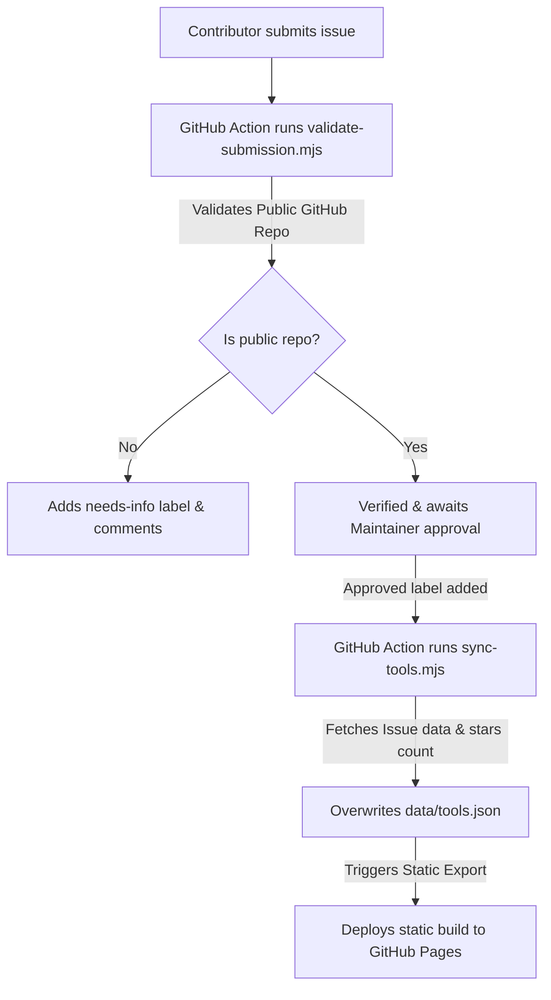

# Contributing to Tool Shed (Tiny-island)

Thank you for your interest in contributing to the **Tool Shed**! We love contributions of all kinds, whether you are submitting a new tiny project, improving the web interface, or fixing bugs in the scripts.

---

## Table of Contents

- [Ways to Contribute](#ways-to-contribute)
  - [1. Submitting a Tool or Game](#1-submitting-a-tool-or-game)
  - [2. Submitting Programmatically (For AI Agents)](#2-submitting-programmatically-for-ai-agents)
  - [3. Code and UI Contributions](#3-code-and-ui-contributions)
- [Local Development Setup](#local-development-setup)
  - [Prerequisites](#prerequisites)
  - [Installation](#installation)
  - [Running the Dev Server](#running-the-dev-server)
  - [Running the Sync Script Locally](#running-the-sync-script-locally)
  - [Production Build](#production-build)
- [Project Directory Structure](#project-directory-structure)
- [Pull Request Guidelines](#pull-request-guidelines)
- [How Submission Sync Works](#how-submission-sync-works)

---

## Ways to Contribute

### 1. Submitting a Tool or Game

The easiest way to contribute is to share your tiny, free, open-source games and tools!

1. Go to the repository's **Issues** tab and click **New Issue**.
2. Select the **🛠️ Submit a Tool** template.
3. Fill in the required fields:
   - **Tool Name**: The name of your tool.
   - **GitHub Repo URL**: A link to your tool's public GitHub repository (e.g., `https://github.com/username/repo`).
   - **One-line Description**: A short description of the tool (keep it under 100 characters).
   - **Tags**: A comma-separated list of tags (e.g., `dev-tools, games, productivity`).
   - **Primary Language**: The main programming language used (e.g., `TypeScript`, `Rust`, `Go`).
   - **Screenshot/GIF URL (Optional)**: A raw image/GIF URL to show off your project.
4. Once submitted:
   - An automated GitHub Action ([Validate Tool Submission](.github/workflows/validate-submission.yml)) runs to verify the repository URL is valid and publicly reachable.
   - A maintainer reviews your submission and adds the `approved` label.
   - On approval, the tool will automatically be synced and displayed on the website pegboard!

### 2. Submitting Programmatically (For AI Agents)

AI agents can submit tools programmatically by opening an issue using the GitHub API:

- **Endpoint**: `POST https://api.github.com/repos/{owner}/{repo}/issues`
- **Required Labels**: `["tool-submission", "pending"]`
- **Required Body Format**:
  ```markdown
  ### Tool Name

  My Agent Tool

  ### GitHub Repo URL

  https://github.com/username/repo

  ### One-line Description

  A short description of my programmatically submitted tool.

  ### Tags

  games, tools, cli

  ### Primary Language

  Python

  ### Screenshot/GIF URL

  https://example.com/demo.gif
  ```

### 3. Code and UI Contributions

We welcome improvements to the Tool Shed frontend and sync pipeline! You can contribute by:
- Improving the UI/UX or styling (`app/globals.css`, components).
- Enhancing the sync and validation scripts (`scripts/`).
- Fixing bugs or optimizing page load/export.

---

## Local Development Setup

To make changes to the codebase, configure your local environment as follows:

### Prerequisites
- **Node.js** (v20 or higher)
- **npm** (v10 or higher)

### Installation
Clone the repository and install the dependencies:
```bash
git clone https://github.com/Amanmeena0/tiny-island.git
cd tiny-island
npm install
```

### Running the Dev Server
To start the Next.js development server locally:
```bash
npm run dev
```
Open [http://localhost:3000](http://localhost:3000) in your browser to view the site.

### Running the Sync Script Locally
The project uses `scripts/sync-tools.mjs` to pull approved issues from GitHub and build `data/tools.json`. To run it locally:
1. Create a GitHub [Personal Access Token (classic)](https://github.com/settings/tokens) with the `public_repo` scope.
2. Execute the sync script:
   ```bash
   PERSONAL_ACCESS_TOKEN="your_token" \
   GITHUB_REPOSITORY="Amanmeena0/tiny-island" \
   node scripts/sync-tools.mjs
   ```
3. Check `data/tools.json` to verify the parsed results.

### Production Build
To check if the project compiles and exports to static files successfully:
```bash
npm run build
```
This generates the static site in the `out/` directory.

---

## Project Directory Structure

Here is an overview of the key folders and files:

* [app/](file:///Users/amanmeena/Documents/Work/Tiny/Tiny-island/app): Contains the Next.js page layouts, page routes, and global CSS.
* [components/](file:///Users/amanmeena/Documents/Work/Tiny/Tiny-island/components): Reusable React components (like the `ToolGrid`).
* [data/](file:///Users/amanmeena/Documents/Work/Tiny/Tiny-island/data): Houses `tools.json`, which acts as the local database. **Do not edit `tools.json` manually**, as it is overwritten by the sync script.
* [scripts/](file:///Users/amanmeena/Documents/Work/Tiny/Tiny-island/scripts): Helper scripts for validating submissions and syncing issues.
* [.github/](file:///Users/amanmeena/Documents/Work/Tiny/Tiny-island/.github): Issue templates and GitHub Action workflows for validating and deploying.

---

## Pull Request Guidelines

1. **Create a Branch**: Create a feature branch with a descriptive name (e.g., `feature/custom-filters`, `bugfix/fix-sync-error`).
2. **Lint and Format**: Run the linter to ensure code style compliance:
   ```bash
   npm run lint
   ```
3. **Write Clear Commit Messages**: Use clear and conventional commit messages.
4. **Test Before Submitting**: Make sure the build compiles cleanly with `npm run build` and all local changes function as expected.
5. **Open a PR**: Submit a pull request to the `main` branch with a clear description of the problem solved or the feature added.

---

## How Submission Sync Works


