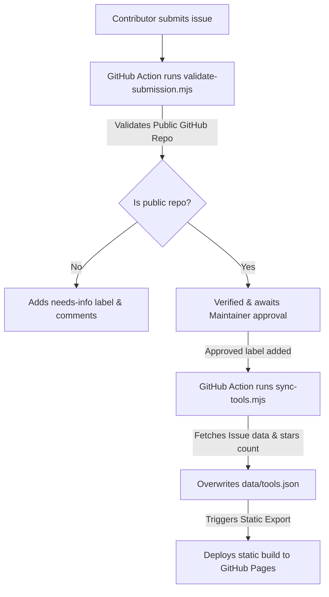

# Contributing to Tool Shed (Kojiima)

Thank you for your interest in contributing to the **Tool Shed**! We love contributions of all kinds, especially from **first-time open-source contributors**. Whether you are submitting a new tiny project, improving the web interface, or writing documentation, we are happy to help you make your contribution!

---

## 📚 Contributor Documentation Index

Before you start, check out our dedicated guides:

- 🌟 **[First-Time Contributor Guide](docs/FIRST_TIME_CONTRIBUTOR_GUIDE.md)** — Beginner guide to open source, Git, and creating your first PR.
- 🏠 **[Submit a Tool or Game Guide](docs/SUBMIT_TOOL_OR_GAME_GUIDE.md)** — Step-by-step guide on submitting your project via GitHub Issues.
- 💻 **[Developer Code Contributor Guide](docs/CODE_CONTRIBUTOR_GUIDE.md)** — Technical guide to Next.js, local setup, and testing sync scripts.
- ❓ **[Contributor FAQ](docs/FAQ.md)** — Answers to common questions about approvals, bot validation, and PRs.
- 🤝 **[Code of Conduct](CODE_OF_CONDUCT.md)** — Our community standards and pledge.

---

## Table of Contents

- [Ways to Contribute](#ways-to-contribute)
  - [1. Submitting a Tool or Game](#1-submitting-a-tool-or-game)
  - [2. Submitting Programmatically (For AI Agents)](#2-submitting-programmatically-for-ai-agents)
  - [3. Code and UI Contributions](#3-code-and-ui-contributions)
- [Local Development Setup](#local-development-setup)
- [Pull Request Guidelines](#pull-request-guidelines)
- [How Submission Sync Works](#how-submission-sync-works)

---

## Ways to Contribute

### 1. Submitting a Tool or Game

The easiest way to contribute is to share your tiny, free, open-source games and tools!

1. Go to the repository's **Issues** tab and click **New Issue**.
2. Select the **🏠 Submit a Tiny Tool** template.
3. Fill in the required fields (Tool Name, GitHub Repo URL, Description, Tags, Language, etc.).
4. Once submitted:
   - An automated GitHub Action ([Validate Tool Submission](.github/workflows/validate-submission.yml)) runs to verify the repository URL is valid and publicly reachable.
   - A maintainer reviews your submission and adds the `approved` label.
   - On approval, the tool will automatically be synced and displayed on the website pegboard!

### 2. Submitting Programmatically (For AI Agents)

AI agents can submit tools programmatically by opening an issue using the GitHub API:

- **Endpoint**: `POST https://api.github.com/repos/{owner}/{repo}/issues`
- **Required Labels**: `["tool-submission", "pending"]`
- **Required Body Format**:
  ```markdown
  ### Tool Name

  My Agent Tool

  ### GitHub Repo URL

  https://github.com/username/repo

  ### One-line Description

  A short description of my programmatically submitted tool.

  ### Tags

  games, tools, cli

  ### Primary Language

  Python

  ### Screenshot/GIF URL

  https://example.com/demo.gif
  ```

### 3. Code and UI Contributions

We welcome improvements to the Tool Shed frontend and sync pipeline! You can contribute by:
- Improving the UI/UX or styling (`app/globals.css`, components).
- Enhancing the sync and validation scripts (`scripts/`).
- Adding features or fixing bugs.

---

## Local Development Setup

To make changes to the codebase, configure your local environment as follows:

```bash
# Clone the repository
git clone https://github.com/Amanmeena0/kojiima.git
cd kojiima

# Install dependencies
npm install

# Run dev server
npm run dev

# Check static production build
npm run build
```

---

## Pull Request Guidelines

1. **Create a Branch**: Create a feature branch with a descriptive name (e.g., `feature/custom-filters`, `docs/add-guide`).
2. **Lint and Format**: Run the linter to ensure code style compliance:
   ```bash
   npm run lint
   ```
3. **Write Clear Commit Messages**: Use clear conventional commit messages (e.g. `docs: update first time contributor guide`).
4. **Test Before Submitting**: Make sure the build compiles cleanly with `npm run build`.
5. **Open a PR**: Submit a pull request to the `main` branch with a clear description using our PR template.

---

## How Submission Sync Works


```mermaid
graph TD
    A[Contributor submits issue] --> B[GitHub Action runs validate-submission.mjs]
    B -->|Validates Public GitHub Repo| C{Is public repo?}
    C -->|No| D[Adds needs-info label & comments]
    C -->|Yes| E[Verified & awaits Maintainer approval]
    E -->|Approved label added| F[GitHub Action runs sync-tools.mjs]
    F -->|Fetches Issue data & stars count| G[Overwrites data/tools.json]
    G -->|Triggers Static Export| H[Deploys static build to GitHub Pages]
```
