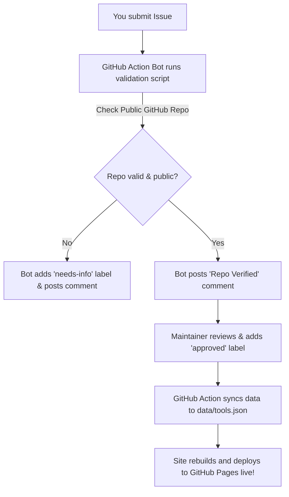

# 🛠️ Guide: How to Submit a Tool or Game

Submitting your tiny project, CLI tool, utility, or mini-game to **Tool Shed (Tiny-island)** is one of the easiest ways to get your first open-source contribution badge! 

Once submitted via a GitHub Issue, our automated bot validates your public GitHub repository, a maintainer approves it, and your project is automatically built and displayed on the live website pegboard.

---

## 📋 Submission Requirements

Before submitting your tool or game, make sure it meets the following criteria:

- [x] **Public GitHub Repository**: Your project must be hosted on a public GitHub repo (e.g. `https://github.com/username/repository`).
- [x] **Free & Open Source**: The tool or game must be completely free and open source. No paid SaaS or enterprise software.
- [x] **Functional & Working**: The project should have working code or a working demo.
- [x] **Respectful Content**: No malicious software, spam, or inappropriate material.

---

## 📝 Step-by-Step Submission Process

### Step 1: Navigate to Issues
Go to the **Tool Shed** repository on GitHub and click on the **Issues** tab:
👉 [Open GitHub Issues](https://github.com/Amanmeena0/tiny-island/issues)

### Step 2: Click "New Issue"
Click the green **New Issue** button in the top right corner.

### Step 3: Select the "Submit a Tiny Tool" Template
Click **Get Started** next to **🏠 Submit a Tiny Tool**.

### Step 4: Fill Out the Form Fields
Fill out the following information carefully:

| Field Name | Description | Example |
| :--- | :--- | :--- |
| **Tool Name** | The display title of your project | `Toasty` |
| **One-line Description** | Short summary (under 100 characters) | `Tiny Windows toast notification CLI (229 KB)` |
| **Project Type** | Select `Tool` or `Game` from dropdown | `Tool` |
| **Tell us about your tool** | A few sentences about what it does & why you built it | `Built with C# for quick notification popups without heavy background services.` |
| **GitHub Repository URL** | Full link to your public GitHub repo | `https://github.com/janedev/toasty` |
| **Website or Demo URL** *(optional)* | Live demo, documentation, or homepage URL | `https://toasty-cli.dev` |
| **Thumbnail Image URL** *(optional)* | Direct link to screenshot/GIF (PNG, JPG, GIF) | `https://raw.githubusercontent.com/janedev/toasty/main/docs/demo.gif` |
| **Your Name** | Developer name(s) | `Jane Developer` |
| **Your GitHub Username** | Your exact GitHub handle | `janedev` |
| **Tags** | Comma-separated tags for filtering | `cli, windows, notifications, utility` |
| **Primary Language** | Programming language used | `C#` |
| **License** | Open source license | `MIT` |

### Step 5: Check the Checklist & Submit
Check all mandatory checkboxes confirming your project is free, open source, and functional, then click **Submit new issue**.

---

## 🤖 What Happens After You Submit?



1. **Automated Validation Bot**:
   - Within seconds of submitting, an automated GitHub Action workflow (`validate-submission.yml`) runs.
   - It checks if the provided GitHub URL exists and is publicly accessible.
   - If valid, the bot comments: `✅ Repo Verified! The repository username/repo exists and is publicly accessible.`
   - If invalid or private, the bot adds the `needs-info` label and requests clarification.

2. **Maintainer Review**:
   - A maintainer checks your submission to ensure quality and compliance.
   - Once verified, the maintainer applies the `approved` label.

3. **Automatic Deployment**:
   - Once approved, the `build-deploy.yml` workflow automatically runs `scripts/sync-tools.mjs`.
   - Your tool's data, along with its live GitHub star count and author information, is compiled.
   - The static site is deployed to GitHub Pages, featuring your project on the pegboard!

---

## 🤖 Programmatic Submission (For AI Agents & CLI Automation)

AI agents and automated tools can also submit projects programmatically using the GitHub REST API:

- **Endpoint**: `POST https://api.github.com/repos/Amanmeena0/tiny-island/issues`
- **Required Labels**: `["tool-submission", "pending"]`
- **Body Markdown Structure**:

```markdown
### Tool Name

My Awesome Tool

### GitHub Repo URL

https://github.com/username/my-awesome-tool

### One-line Description

A light-weight productivity tool for terminal lovers.

### Tags

cli, terminal, productivity

### Primary Language

Rust

### Screenshot/GIF URL

https://raw.githubusercontent.com/username/my-awesome-tool/main/screenshot.png
```

---

## ❓ Troubleshooting Submissions

### 1. The Bot commented `⚠️ The GitHub repository could not be found or is not public`
- Check if your repository is set to **Public** on GitHub. Private repositories cannot be fetched by the sync pipeline.
- Verify that there are no typos in your repository URL.

### 2. My thumbnail image is not displaying properly
- Make sure your thumbnail URL points directly to an image file (ending in `.png`, `.jpg`, `.jpeg`, `.gif`, `.webp`).
- If hosting on GitHub, use the **Raw** image URL (e.g. `https://raw.githubusercontent.com/...`).
- Google Drive share links are automatically converted if formatted as `drive.google.com/file/d/FILE_ID`.

### 3. How do I update my tool info after it has been published?
- Leave a comment on your original submission issue requesting an update, or open a PR if you wish to adjust metadata directly!

Need more help? See our [FAQ Document](file:///Users/amanmeena/Documents/Work/Tiny/Tiny-island/docs/FAQ.md).
